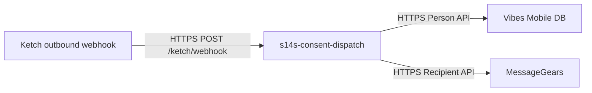

# S14S Consent Dispatch

**Marketing consent and identity dispatch service** — a thin, Docker-hostable HTTP service that receives [Ketch Forwarder](https://github.com/ketch-com/ketch-forwarder) callbacks and propagates changes to downstream engagement platforms.

The first integrations implemented are:

- **Phone number synchronization to Vibes** when a correction includes an updated mobile number.
- **Email address synchronization to MessageGears** when a correction includes an updated email and no phone change is present.

Future work in this repo is expected to include consent preference dispatch (opt-in/opt-out, language) to Vibes and MessageGears.

Repository: [github.com/cesau78/s14s-consent-dispatch](https://github.com/cesau78/s14s-consent-dispatch)

## Table of Contents

- [Overview](#overview)
- [Terminology: Webhook vs Forwarder](#terminology-webhook-vs-forwarder)
- [Quick Start](#quick-start)
- [Ketch webhook configuration](#ketch-webhook-configuration)
- [API](#api)
- [Payload examples](#payload-examples)
- [Phone Change Flow](#phone-change-flow)
- [Vibes Integration](#vibes-integration)
- [MessageGears Integration](#messagegears-integration)
- [Configuration](#configuration)
- [Local development testing](#local-development-testing)
- [Docker](#docker)
- [Testing](#testing)
- [Project Structure](#project-structure)
- [Known Limitations](#known-limitations)

---

## Overview

Privacy and marketing systems often disagree on subscriber identity. Ketch acts as the consent and privacy layer; Vibes holds the mobile engagement database. This service sits between them:

1. Ketch sends an outbound **webhook** (HTTP POST) to this service when a relevant event occurs.
2. The service extracts phone or email changes and downstream identifiers from the payload.
3. Phone corrections call the Vibes Mobile Database API; email-only corrections call the MessageGears recipient API.

The service is intentionally small: Express, no database, stateless except for outbound API calls. It is designed to run in Docker behind your edge load balancer or API gateway.



---

## Terminology: Webhook vs Forwarder

These terms describe different layers of the same integration—not two competing approaches.

| Term | What it means |
|------|----------------|
| **Webhook** | The *delivery pattern*: Ketch calls your HTTPS URL when something happens. You expose a receiver, verify auth, process the JSON body, and return a response. That is exactly what this service implements. |
| **Ketch Forwarder** | Ketch’s *product name and protocol* for that webhook: typed envelopes (`kind`, `apiVersion`, `metadata`), DSR flows (`CorrectionRequest`, …), and consent messages (`ConsentRequest`, …). Spec: [ketch-com/ketch-forwarder](https://github.com/ketch-com/ketch-forwarder). |

In Ketch’s admin UI you typically configure a **Forwarder** (or forwarder endpoint) with a URL and shared secret. Colloquially that endpoint is a webhook; formally the payload follows the Forwarder specification.

This repo uses **webhook** in routes and docs for the generic pattern, and **Forwarder** when referring to Ketch’s message kinds and response shapes. Inbound logic lives in **callback-handlers** (one module per callback type); each callback-handler is protocol-specific rather than a generic catch-all router.

---

## Quick Start

```bash
# Install dependencies
npm install

# Copy and edit environment variables
cp .env.example .env

# Run locally
npm start

# Run tests
npm test
```

Default port: **3000**. Health check: `GET /health`.

---

## Ketch webhook configuration

Register a **Forwarder** endpoint in the Ketch UI (this is Ketch’s name for the outbound webhook integration). Payloads must follow the [Ketch Forwarder](https://github.com/ketch-com/ketch-forwarder) protocol:

| Setting | Value |
|---------|--------|
| **URL** | `https://<your-host>` + one of your configured paths (default `/ketch/webhook`) |
| **Protocol** | HTTPS |
| **Header** | Same name as `KETCH_CALLBACK_AUTH_HEADER` (default `Authorization`) |
| **Header value** | Same string as `KETCH_CALLBACK_AUTH_VALUE` in `.env` |

### Supported message kinds (phone sync)

| Kind | Behavior |
|------|----------|
| `CorrectionRequest` | Parses phone or email change, updates Vibes and/or MessageGears, returns `200` with `{ "downstream": [...] }` |
| `CorrectionStatusEvent` | Same parsing and downstream updates as `CorrectionRequest`; returns `200` with `downstream` |
| Other kinds (e.g. `ConsentRequest`) | Acknowledged with `200` and `{ "downstream": [] }`; no downstream call |

Phone corrections align with Ketch’s [Correction](https://github.com/ketch-com/ketch-forwarder/blob/main/api/dsr/v1/Correction.md) DSR flow. Ensure Ketch identities and context variables are configured so this service can resolve a Vibes person (see [Phone Change Flow](#phone-change-flow)).

---

## API

| Method | Path | Description |
|--------|------|-------------|
| `GET` | `/health` | Liveness probe (`{ "status": "ok" }`) — not IP/auth protected |
| `POST` | *(configured)* | Inbound Ketch callbacks — see `KETCH_CALLBACK_PATHS` |

Default webhook paths: `/ketch/webhook`, `/ketch/forwarder` (both use the same callback-handler).

### Webhook security

Inbound Ketch routes are protected by `ketchCallbackIpAllowlist` and `ketchCallbackAuth` (in that order). Configure in `.env`:

| Variable | Description |
|----------|-------------|
| `KETCH_CALLBACK_PATHS` | Comma-separated POST paths to register (default `/ketch/webhook,/ketch/forwarder`) |
| `KETCH_CALLBACK_AUTH_HEADER` | Header name Ketch must send (default `Authorization`) |
| `KETCH_CALLBACK_AUTH_VALUE` | Exact header value Ketch must send (required). Use `Bearer local-dev` for local work — that value also requires a loopback or Docker-bridge TCP peer (`X-Forwarded-For` is ignored). |
| `KETCH_ALLOWED_IPS` | Comma-separated IPs or CIDR blocks (e.g. `203.0.113.4,198.51.100.0/24`); unset allows any IP |
| `TRUST_PROXY` | `true`, `false`, or hop count — use `true` behind a load balancer so `X-Forwarded-For` is honored |

Legacy env names (`KETCH_WEBHOOK_PATHS`, `KETCH_WEBHOOK_AUTH_HEADER`, `KETCH_WEBHOOK_AUTH_VALUE`, `KETCH_FORWARDER_AUTH`) are still read if the `KETCH_CALLBACK_*` vars are unset.

Ketch sends the secret from **their servers only**; it is not returned to the data subject’s browser. Restrict `KETCH_ALLOWED_IPS` to Ketch egress ranges once your account team provides them.

### Example: CorrectionRequest

**Request** (from Ketch):

```http
POST /ketch/webhook HTTP/1.1
Authorization: Bearer <your-shared-secret>
Content-Type: application/json

{
  "apiVersion": "dsr/v1",
  "kind": "CorrectionRequest",
  "metadata": {
    "uid": "22880925-aac5-42f9-a653-cb6921d361ff",
    "tenant": "your-tenant"
  },
  "request": {
    "identities": [
      {
        "identitySpace": "person_key",
        "identityFormat": "raw",
        "identityValue": "vibes-person-abc123"
      },
      {
        "identitySpace": "phone",
        "identityFormat": "raw",
        "identityValue": "+12145551234"
      },
      {
        "identitySpace": "account_id",
        "identityFormat": "raw",
        "identityValue": "crm-customer-99"
      }
    ]
  }
}
```

**Response** (to Ketch):

```http
HTTP/1.1 200 OK
Content-Type: application/json

{
  "downstream": [
    {
      "system": "Vibes",
      "update": 200,
      "updated": "20260501T12:12:12.123"
    }
  ]
}
```

Each `downstream` entry reports the HTTP status from the downstream API (`update`) and a UTC timestamp (`updated`, compact `YYYYMMDDTHH:mm:ss.sss`). When nothing is updated, `downstream` is an empty array.

### Error responses

| Status | When |
|--------|------|
| `401` | Missing or invalid webhook auth header |
| `403` | Caller IP not in `KETCH_ALLOWED_IPS` |
| `400` | Malformed payload (e.g. missing `kind`) |
| `422` | Phone present but no Vibes `person_key` or `external_person_id` identity |
| `500` | Unexpected error; Vibes API failures include `details` when available |

---

## Payload examples

Sample JSON files for local testing live under [`examples/ketch/`](examples/ketch/). Replace placeholder identities with values that exist in your Vibes sandbox.

### CorrectionRequest — phone in identities (updates Vibes)

Ketch POSTs to your webhook; service responds `200` with a `downstream` array.

**Request body:**

```json
{
  "apiVersion": "dsr/v1",
  "kind": "CorrectionRequest",
  "metadata": {
    "uid": "22880925-aac5-42f9-a653-cb6921d361ff",
    "tenant": "your-tenant"
  },
  "request": {
    "property": "your-property",
    "environment": "production",
    "regulation": "ccpa",
    "jurisdiction": "usca",
    "identities": [
      {
        "identitySpace": "person_key",
        "identityFormat": "raw",
        "identityValue": "vibes-person-abc123"
      },
      {
        "identitySpace": "phone",
        "identityFormat": "raw",
        "identityValue": "+12145551234"
      },
      {
        "identitySpace": "account_id",
        "identityFormat": "raw",
        "identityValue": "crm-customer-99"
      }
    ],
    "subject": {
      "email": "subscriber@example.com",
      "firstName": "Jamie",
      "lastName": "Example"
    },
    "submittedTimestamp": 1715900000,
    "dueTimestamp": 1716500000
  }
}
```

**Response body:**

```json
{
  "downstream": [
    {
      "system": "Vibes",
      "update": 200,
      "updated": "20260501T12:12:12.123"
    }
  ]
}
```

**Vibes action:** `PUT .../persons/vibes-person-abc123` with `{ "mobile_phone": { "mdn": "+12145551234" }, "external_person_id": "crm-customer-99" }`.

---

### CorrectionRequest — phone in context

Use when Ketch maps the new number to a context variable instead of a `phone` identity space.

```json
{
  "apiVersion": "dsr/v1",
  "kind": "CorrectionRequest",
  "metadata": {
    "uid": "a1b2c3d4-e5f6-7890-abcd-ef1234567890",
    "tenant": "your-tenant"
  },
  "request": {
    "property": "your-property",
    "environment": "production",
    "regulation": "ccpa",
    "jurisdiction": "usca",
    "identities": [
      {
        "identitySpace": "person_key",
        "identityValue": "vibes-person-abc123"
      }
    ],
    "context": {
      "mobilePhone": "+13125550198",
      "account_id": "crm-customer-99"
    },
    "submittedTimestamp": 1715900000,
    "dueTimestamp": 1716500000
  }
}
```

---

### CorrectionRequest — phone in subject.formData

Common when the DSR form captures the new number in a custom field.

```json
{
  "apiVersion": "dsr/v1",
  "kind": "CorrectionRequest",
  "metadata": {
    "uid": "b2c3d4e5-f6a7-8901-bcde-f12345678901",
    "tenant": "your-tenant"
  },
  "request": {
    "property": "your-property",
    "environment": "production",
    "regulation": "ccpa",
    "jurisdiction": "usca",
    "identities": [
      {
        "identitySpace": "external_person_id",
        "identityValue": "crm-customer-44"
      }
    ],
    "subject": {
      "email": "subscriber@example.com",
      "firstName": "Jamie",
      "lastName": "Example",
      "formData": {
        "mobile_phone": "3125550198"
      }
    },
    "submittedTimestamp": 1715900000,
    "dueTimestamp": 1716500000
  }
}
```

**Vibes action:** `POST .../persons/` (no `person_key`) with `external_person_id` + normalized E.164 MDN.

---

### CorrectionStatusEvent — phone in event envelope

Status events use `event` instead of `request`. Service responds `200` with the same `downstream` shape as `CorrectionRequest`.

```json
{
  "apiVersion": "dsr/v1",
  "kind": "CorrectionStatusEvent",
  "metadata": {
    "uid": "22880925-aac5-42f9-a653-cb6921d361ff",
    "tenant": "your-tenant"
  },
  "event": {
    "status": "in_progress",
    "identities": [
      {
        "identitySpace": "person_key",
        "identityValue": "vibes-person-abc123"
      },
      {
        "identitySpace": "mobile",
        "identityValue": "+12145559876"
      }
    ]
  }
}
```

---

### CorrectionRequest — no phone present

Acknowledged without calling Vibes.

```json
{
  "apiVersion": "dsr/v1",
  "kind": "CorrectionRequest",
  "metadata": {
    "uid": "c3d4e5f6-a7b8-9012-cdef-123456789012",
    "tenant": "your-tenant"
  },
  "request": {
    "identities": [
      {
        "identitySpace": "person_key",
        "identityValue": "vibes-person-abc123"
      }
    ],
    "subject": {
      "firstName": "Jamie",
      "lastName": "Example",
      "description": "Please correct my mailing address only"
    }
  }
}
```

**Response:**

```json
{ "downstream": [] }
```

---

### ConsentRequest — not handled for phone sync

Acknowledged with `200` and `{ "downstream": [] }`; no downstream call. Included so you can verify routing and auth without triggering an update.

```json
{
  "apiVersion": "consent/v1",
  "kind": "ConsentRequest",
  "metadata": {
    "uid": "d4e5f6a7-b8c9-0123-def0-234567890123",
    "tenant": "your-tenant"
  },
  "request": {
    "property": "your-property",
    "environment": "production",
    "regulation": "ccpa",
    "jurisdiction": "usca",
    "identities": [
      {
        "identitySpace": "account_id",
        "identityValue": "crm-customer-99"
      }
    ],
    "purposes": {
      "email_mktg": "denied",
      "sms_mktg": "granted"
    },
    "legalBasis": {
      "email_mktg": "consent_optout",
      "sms_mktg": "consent_optin"
    },
    "collectedAt": 1715900000
  }
}
```

**Response:**

```json
{ "downstream": [] }
```

---

Each file below lives in [`examples/ketch/`](examples/ketch/). See [Local development testing](#local-development-testing) for how to run them against a local stack.

| File | Kind | What it exercises | HTTP | Downstream (mock or real) |
|------|------|-------------------|------|---------------------------|
| [`correction-request-phone.json`](examples/ketch/correction-request-phone.json) | `CorrectionRequest` | Phone in **identities** (`phone` space) plus `person_key` and `account_id` | `200` + `downstream: [Vibes]` | `PUT .../persons/vibes-person-abc123` |
| [`correction-request-context-phone.json`](examples/ketch/correction-request-context-phone.json) | `CorrectionRequest` | Phone in **context** (`mobilePhone`) with `person_key` | `200` + `downstream: [Vibes]` | `PUT .../persons/vibes-person-abc123` |
| [`correction-request-formdata-phone.json`](examples/ketch/correction-request-formdata-phone.json) | `CorrectionRequest` | Phone in **subject.formData** (`mobile_phone`); only `external_person_id` identity | `200` + `downstream: [Vibes]` | `POST .../persons/` |
| [`correction-status-event-phone.json`](examples/ketch/correction-status-event-phone.json) | `CorrectionStatusEvent` | Phone in **event** envelope (`mobile` identity) | `200` + `downstream: [Vibes]` | `PUT .../persons/vibes-person-abc123` |
| [`correction-request-no-phone.json`](examples/ketch/correction-request-no-phone.json) | `CorrectionRequest` | Correction with `person_key` but **no** phone or email field | `200` + `downstream: []` | None |
| [`consent-request.json`](examples/ketch/consent-request.json) | `ConsentRequest` | Consent-only message (future work); routing and auth only | `200` + `downstream: []` | None |
| [`correction-request-email.json`](examples/ketch/correction-request-email.json) | `CorrectionRequest` | Email in **identities** plus `recipient_id` | `200` + `downstream: [MessageGears]` | `PUT .../recipients/mg-recipient-abc123` |
| [`correction-request-context-email.json`](examples/ketch/correction-request-context-email.json) | `CorrectionRequest` | Email in **context** (`emailAddress`) | `200` + `downstream: [MessageGears]` | `PUT` |
| [`correction-request-formdata-email.json`](examples/ketch/correction-request-formdata-email.json) | `CorrectionRequest` | Email in **subject.formData**; external id only | `200` + `downstream: [MessageGears]` | `POST .../recipients/` |
| [`correction-status-event-email.json`](examples/ketch/correction-status-event-email.json) | `CorrectionStatusEvent` | Email in **event** envelope | `200` + `downstream: [MessageGears]` | `PUT` |

Phone takes precedence: if both phone and email are present, only Vibes is called.

---

## Local development testing

There is no official Docker image for the Ketch cloud or the Vibes Mobile DB API. For local work you simulate **inbound Ketch** webhooks with the JSON files above and **outbound Vibes** with [WireMock](https://wiremock.org/) (included in this repo) or your own Vibes sandbox credentials.

### Option A — Docker Compose + WireMock (recommended)

Starts **consent-dispatch** on port **3000** and a **WireMock** Vibes stub on port **8080**.

```bash
cp .env.dev .env.dev.local   # optional; .env.dev is committed with safe defaults
npm run dev:compose
# or: docker compose -f docker-compose.yml -f docker-compose.dev.yml up --build
```

| Service | URL |
|---------|-----|
| Dispatch | `http://localhost:3000` (`GET /health`) |
| WireMock (Vibes stub) | `http://localhost:8080` |
| WireMock admin | `http://localhost:8080/__admin` |

`.env.dev` points `VIBES_*` at company key `local-dev` and sets `KETCH_CALLBACK_AUTH_VALUE=Bearer local-dev`. That header is always required; the service also checks the **direct TCP peer** (not `X-Forwarded-For`) is loopback or a Docker bridge address so a remote client cannot spoof local dev by sending the header alone.

Run every example payload in one step:

```bash
npm run smoke:local:docker
```

Or POST a single file:

```bash
curl -sS -X POST "http://localhost:3000/ketch/webhook" \
  -H "Authorization: Bearer local-dev" \
  -H "Content-Type: application/json" \
  --data-binary "@examples/ketch/correction-request-phone.json"
```

WireMock stubs live under [`docker/wiremock/mappings/`](docker/wiremock/mappings/) — Vibes person `PUT`/`POST` and MessageGears recipient `PUT`/`POST` for account `local-dev` on the same port.

**Smoke failures?** Rebuild **both** services so code and stubs stay in sync:

```bash
docker compose -f docker-compose.yml -f docker-compose.dev.yml up --build -d
docker compose -f docker-compose.yml -f docker-compose.dev.yml up -d --force-recreate wiremock
npm run smoke:local
```

Confirm WireMock loaded four stubs: `curl http://localhost:8080/__admin/mappings` → `"total": 4`. If phone cases return `CorrectionResponse` or status events return `204`, the dispatch container is still on an old image.

### Option B — Node on the host + WireMock

Terminal 1 — Vibes stub:

```bash
docker run --rm -p 8080:8080 \
  -v "%cd%/docker/wiremock:/home/wiremock" \
  wiremock/wiremock:3.9.1
```

On macOS/Linux use `` `pwd` `` instead of `%cd%`.

Terminal 2 — dispatch (copy `.env.dev` or set vars manually):

```bash
cp .env.dev .env
# For npm on the host, point Vibes at the stub on localhost:
# VIBES_API_BASE_URL=http://localhost:8080
npm start
```

Set `KETCH_CALLBACK_AUTH_VALUE=Bearer local-dev` in `.env` (or copy `.env.dev`), then:

```bash
npm run smoke:local
```

### Option C — Real Vibes sandbox

Copy `.env.example` to `.env`, set `VIBES_COMPANY_KEY`, `VIBES_API_USERNAME`, and `VIBES_API_PASSWORD` from your Vibes account, and replace placeholder `person_key` / `external_person_id` values in the example JSON with records that exist in that tenant. Leave `VIBES_API_BASE_URL` at `https://public-api.vibescm.com`.

### Manual curl

Local (`.env.dev` / `Bearer local-dev`):

```bash
curl -sS -X POST "http://localhost:3000/ketch/webhook" \
  -H "Authorization: Bearer local-dev" \
  -H "Content-Type: application/json" \
  --data-binary "@examples/ketch/correction-request-phone.json"
```

Production (unique secret registered in Ketch):

```bash
curl -sS -X POST "http://localhost:3000/ketch/webhook" \
  -H "Authorization: Bearer <your-secret>" \
  -H "Content-Type: application/json" \
  --data-binary "@examples/ketch/correction-request-phone.json"
```

### Connecting real Ketch to your laptop

Use a tunnel (ngrok, Cloudflare Tunnel, etc.) to expose `https://…` → `localhost:3000`, then register that URL and the same `Authorization` value in the Ketch Forwarder endpoint UI.

---

## Phone Change Flow

### 1. Extract phone number

The parser looks for a valid mobile number in this order:

1. **Identities** whose `identitySpace` matches `KETCH_PHONE_IDENTITY_SPACES` (default: `phone`, `mobile`, `mdn`, `mobile_phone`)
2. **Context** keys matching `KETCH_PHONE_CONTEXT_KEYS` (default: `phone`, `mobilePhone`, `mobile_phone`, `mdn`)
3. **Subject** fields (`phone`, `mobilePhone`, `mobile_phone`) or `subject.formData`

Numbers are normalized to **E.164** via `libphonenumber-js` (default country: US).

### 2. Resolve Vibes person

| Source | Config variable | Default identity spaces |
|--------|-----------------|-------------------------|
| Vibes `person_key` | `KETCH_VIBES_PERSON_KEY_IDENTITY_SPACES` | `vibes_person_key`, `person_key` |
| Vibes `external_person_id` | `KETCH_EXTERNAL_PERSON_ID_IDENTITY_SPACES` | `account_id`, `external_person_id`, `customer_id` |

At least one of `person_key` or `external_person_id` is required when a phone change is detected.

### 3. Call Vibes

- If **`person_key`** is present → `PUT /companies/{company_key}/mobiledb/persons/{person_key}`
- If only **`external_person_id`** is present → `POST /companies/{company_key}/mobiledb/persons/` (create or merge per Vibes rules)

Payload shape (API v2):

```json
{
  "external_person_id": "crm-customer-99",
  "mobile_phone": {
    "mdn": "+12145551234"
  }
}
```

Status events use the `event` envelope instead of `request`; the same extraction logic applies.

---

## Vibes Integration

Uses the [Vibes public API](https://developer-platform.vibes.com/) with **HTTP Basic Authentication** (username + password from your Vibes account).

| Variable | Description |
|----------|-------------|
| `VIBES_API_BASE_URL` | Default: `https://public-api.vibescm.com` |
| `VIBES_COMPANY_KEY` | Your Vibes company key |
| `VIBES_API_USERNAME` | API username (email) |
| `VIBES_API_PASSWORD` | API password |
| `VIBES_API_VERSION` | Default: `2` (E.164 required for MDN) |

See Vibes [Data Syncing Guide](https://developer-platform.vibes.com/docs/data-syncing-guide) for broader integration context.

---

## MessageGears Integration

Email corrections use a configurable REST profile API (see `messageGearsClient.js`). WireMock stubs mirror the Vibes dev pattern on port **8080**.

| Variable | Description |
|----------|-------------|
| `MESSAGEGEARS_API_BASE_URL` | Default: `https://api.messagegears.com` |
| `MESSAGEGEARS_ACCOUNT_ID` | Your MessageGears account id |
| `MESSAGEGEARS_API_KEY` | Bearer token for API calls |
| `KETCH_EMAIL_IDENTITY_SPACES` | Identity spaces carrying email (default `email`, `email_address`) |
| `KETCH_EMAIL_CONTEXT_KEYS` | Context / form keys for email (default `email`, `emailAddress`, `email_address`) |
| `KETCH_MESSAGEGEARS_RECIPIENT_ID_IDENTITY_SPACES` | Recipient id (default `messagegears_recipient_id`, `recipient_id`) |
| `KETCH_MESSAGEGEARS_EXTERNAL_RECIPIENT_ID_IDENTITY_SPACES` | External recipient id (default includes `account_id`, `external_recipient_id`, …) |

**API paths (local WireMock):**

- `PUT /api/v1/accounts/{accountId}/recipients/{recipientId}`
- `POST /api/v1/accounts/{accountId}/recipients/`

---

## Configuration

Copy `.env.example` to `.env` and set values before running in production.

```bash
PORT=3000
TRUST_PROXY=true

KETCH_CALLBACK_PATHS=/ketch/webhook,/ketch/forwarder
KETCH_CALLBACK_AUTH_HEADER=Authorization
KETCH_CALLBACK_AUTH_VALUE=Bearer <shared-secret>
KETCH_ALLOWED_IPS=203.0.113.4,198.51.100.0/24

KETCH_VIBES_PERSON_KEY_IDENTITY_SPACES=vibes_person_key,person_key
KETCH_EXTERNAL_PERSON_ID_IDENTITY_SPACES=account_id,external_person_id,customer_id
KETCH_PHONE_IDENTITY_SPACES=phone,mobile,mdn,mobile_phone
KETCH_PHONE_CONTEXT_KEYS=phone,mobilePhone,mobile_phone,mdn

VIBES_COMPANY_KEY=
VIBES_API_USERNAME=
VIBES_API_PASSWORD=
VIBES_API_VERSION=2
```

All list variables are comma-separated and matched case-insensitively.

---

## Docker

**Production-style** (dispatch only; configure `.env` with real Vibes credentials):

```bash
docker compose up --build
```

**Local dev** (dispatch + WireMock Vibes stub — see [Local development testing](#local-development-testing)):

```bash
npm run dev:compose
```

The `Dockerfile` uses Node 22 Alpine, installs production dependencies only, and exposes port 3000. Mount or inject `.env` via your orchestrator’s secrets mechanism in production (do not commit `.env`). Committed [`.env.dev`](.env.dev) is for the WireMock dev stack only.

---

## Continuous security

GitHub Actions and Dependabot run on every push/PR to `main` (see [`.github/workflows/`](.github/workflows/) and [`.github/dependabot.yml`](.github/dependabot.yml)). No paid third-party scanners are required.

| Tool | What it checks | Setup |
|------|----------------|--------|
| **CodeQL** | SAST on JavaScript (`src/`) — injection, unsafe flows, etc. | None — runs automatically |
| **Dependency Review** | Blocks PRs that add vulnerable dependencies | None — uses GitHub Dependency Graph |
| **Dependabot** | npm + Actions version and security updates | None — opens weekly PRs |

Findings appear under **Security → Code scanning alerts** (CodeQL) and **Dependabot alerts** (dependencies). Enable [GitHub secret scanning](https://docs.github.com/en/code-security/secret-scanning) on the repo for leaked credentials in git history (separate from SAST).

Local dependency check:

```bash
npm audit
```

---

## Testing

```bash
# Run tests with coverage (must meet 100% thresholds)
npm test

# Same check used by the git pre-commit hook
npm run build
```

A **husky** `pre-commit` hook runs `npm run build`, which fails the commit if coverage drops below **100%** for branches, functions, lines, and statements (see `jest.config.js`).

Jest + Supertest cover:

- Callback IP allowlist and auth middleware (configurable paths)
- Payload parsing (identities, context, form data, status events)
- Ketch phone callback-handler (correction flow, ignored kinds, validation errors)
- Vibes client (PUT vs POST, error handling)
- Route integration

Coverage report is written to `coverage/`.

---

## Project Structure

```
s14s-consent-dispatch/
├── src/
│   ├── app.js                 # Express app, error handler, routes
│   ├── server.js              # Entry point
│   ├── config.js              # Environment configuration
│   ├── middleware/
│   │   ├── ketchCallbackIpAllowlist.js
│   │   └── ketchCallbackAuth.js
│   ├── routes/
│   │   └── ketchCallbackHandler.js
│   ├── callback-handlers/
│   │   ├── ketchPhoneCallbackHandler.js
│   │   └── ketchEmailCallbackHandler.js
│   └── services/
│       ├── clientIp.js
│       ├── emailNormalizer.js
│       ├── ipAllowlist.js
│       ├── ketchCallbackDispatcher.js
│       ├── ketchCorrectionUtils.js
│       ├── ketchPayloadParser.js
│       ├── messageGearsClient.js
│       ├── phoneNormalizer.js
│       └── vibesClient.js
├── examples/ketch/          # Sample Ketch webhook JSON bodies
├── docker/wiremock/         # WireMock stubs for local Vibes API
├── scripts/smoke-local.js   # POST all example payloads (npm run smoke:local)
├── tests/
├── Dockerfile
├── docker-compose.yml
├── docker-compose.dev.yml   # Overlay: WireMock + .env.dev
├── .github/workflows/       # CodeQL, dependency review
├── .github/dependabot.yml
├── .env.example
├── .env.dev                 # Safe defaults for local Docker dev
└── package.json
```

---

## Known Limitations

1. **Vibes MDN updates** — Vibes does not allow changing an MDN on an existing person record in all cases; updates may return `409`. You may need a remove-then-add or merge workflow for true number changes. See [Update person by person_key](https://developer-platform.vibes.com/reference/put_update-person-by-person_key).

2. **Scope** — Phone (Vibes) and email (MessageGears) sync via correction-related forwarder kinds are implemented. Consent preference dispatch is not yet built.

3. **Idempotency** — Duplicate Ketch deliveries may result in duplicate Vibes API calls; add deduplication at the gateway or via `metadata.uid` if required.

4. **Auth** — Shared header secret plus optional IP allowlist; rotate via env reload/redeploy. Confirm Ketch egress IPs with your account team before relying on `KETCH_ALLOWED_IPS` alone.

---

## Related Projects

- [s14s-identify](https://github.com/cesau78/s14s-identify) — Enterprise identifier registry (customer matching across source systems)
