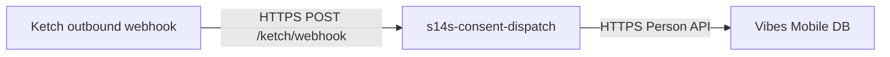

# S14S Consent Dispatch

**Marketing consent and identity dispatch service** — a thin, Docker-hostable HTTP service that receives [Ketch Forwarder](https://github.com/ketch-com/ketch-forwarder) callbacks and propagates changes to downstream engagement platforms.

The first integration implemented is **phone number synchronization to Vibes** when a data subject correction (or related status event) includes an updated mobile number.

Future work in this repo is expected to include consent preference dispatch (opt-in/opt-out, language) to Vibes and MessageGears.

Repository: [github.com/cesau78/s14s-consent-dispatch](https://github.com/cesau78/s14s-consent-dispatch)

## Table of Contents

- [Overview](#overview)
- [Terminology: Webhook vs Forwarder](#terminology-webhook-vs-forwarder)
- [Quick Start](#quick-start)
- [Ketch webhook configuration](#ketch-webhook-configuration)
- [API](#api)
- [Payload examples](#payload-examples)
- [Phone Change Flow](#phone-change-flow)
- [Vibes Integration](#vibes-integration)
- [Configuration](#configuration)
- [Docker](#docker)
- [Testing](#testing)
- [Project Structure](#project-structure)
- [Known Limitations](#known-limitations)

---

## Overview

Privacy and marketing systems often disagree on subscriber identity. Ketch acts as the consent and privacy layer; Vibes holds the mobile engagement database. This service sits between them:

1. Ketch sends an outbound **webhook** (HTTP POST) to this service when a relevant event occurs.
2. The service extracts the updated phone number and person identifiers from the payload.
3. The service calls the Vibes Mobile Database API to update (or create/merge) the person record.

The service is intentionally small: Express, no database, stateless except for outbound API calls. It is designed to run in Docker behind your edge load balancer or API gateway.



---

## Terminology: Webhook vs Forwarder

These terms describe different layers of the same integration—not two competing approaches.

| Term | What it means |
|------|----------------|
| **Webhook** | The *delivery pattern*: Ketch calls your HTTPS URL when something happens. You expose a receiver, verify auth, process the JSON body, and return a response. That is exactly what this service implements. |
| **Ketch Forwarder** | Ketch’s *product name and protocol* for that webhook: typed envelopes (`kind`, `apiVersion`, `metadata`), DSR flows (`CorrectionRequest`, …), and consent messages (`ConsentRequest`, …). Spec: [ketch-com/ketch-forwarder](https://github.com/ketch-com/ketch-forwarder). |

In Ketch’s admin UI you typically configure a **Forwarder** (or forwarder endpoint) with a URL and shared secret. Colloquially that endpoint is a webhook; formally the payload follows the Forwarder specification.

This repo uses **webhook** in routes and docs for the generic pattern, and **Forwarder** when referring to Ketch’s message kinds and response shapes. Inbound logic lives in **callback-handlers** (one module per callback type); each callback-handler is protocol-specific rather than a generic catch-all router.

---

## Quick Start

```bash
# Install dependencies
npm install

# Copy and edit environment variables
cp .env.example .env

# Run locally
npm start

# Run tests
npm test
```

Default port: **3000**. Health check: `GET /health`.

---

## Ketch webhook configuration

Register a **Forwarder** endpoint in the Ketch UI (this is Ketch’s name for the outbound webhook integration). Payloads must follow the [Ketch Forwarder](https://github.com/ketch-com/ketch-forwarder) protocol:

| Setting | Value |
|---------|--------|
| **URL** | `https://<your-host>` + one of your configured paths (default `/ketch/webhook`) |
| **Protocol** | HTTPS |
| **Header** | Same name as `KETCH_WEBHOOK_AUTH_HEADER` (default `Authorization`) |
| **Header value** | Same string as `KETCH_WEBHOOK_AUTH_VALUE` in `.env` |

### Supported message kinds (phone sync)

| Kind | Behavior |
|------|----------|
| `CorrectionRequest` | Parses phone change, updates Vibes, returns `200` with `CorrectionResponse` (`status: completed`) |
| `CorrectionStatusEvent` | Parses phone change, updates Vibes, returns `204 No Content` |
| Other kinds (e.g. `ConsentRequest`) | Acknowledged with `204`; no Vibes call |

Phone corrections align with Ketch’s [Correction](https://github.com/ketch-com/ketch-forwarder/blob/main/api/dsr/v1/Correction.md) DSR flow. Ensure Ketch identities and context variables are configured so this service can resolve a Vibes person (see [Phone Change Flow](#phone-change-flow)).

---

## API

| Method | Path | Description |
|--------|------|-------------|
| `GET` | `/health` | Liveness probe (`{ "status": "ok" }`) — not IP/auth protected |
| `POST` | *(configured)* | Inbound Ketch webhooks — see `KETCH_WEBHOOK_PATHS` |

Default webhook paths: `/ketch/webhook`, `/ketch/forwarder` (both use the same callback-handler).

### Webhook security

Inbound Ketch routes are protected by `ketchWebhookGuard` (IP allowlist + shared header secret). Configure in `.env`:

| Variable | Description |
|----------|-------------|
| `KETCH_WEBHOOK_PATHS` | Comma-separated POST paths to register (default `/ketch/webhook,/ketch/forwarder`) |
| `KETCH_WEBHOOK_AUTH_HEADER` | Header name Ketch must send (default `Authorization`) |
| `KETCH_WEBHOOK_AUTH_VALUE` | Exact header value Ketch must send; unset disables auth (dev only) |
| `KETCH_ALLOWED_IPS` | Comma-separated IPs or CIDR blocks (e.g. `203.0.113.4,198.51.100.0/24`); unset allows any IP |
| `TRUST_PROXY` | `true`, `false`, or hop count — use `true` behind a load balancer so `X-Forwarded-For` is honored |

`KETCH_FORWARDER_AUTH` is still accepted as a legacy alias for `KETCH_WEBHOOK_AUTH_VALUE`.

Ketch sends the secret from **their servers only**; it is not returned to the data subject’s browser. Restrict `KETCH_ALLOWED_IPS` to Ketch egress ranges once your account team provides them.

### Example: CorrectionRequest

**Request** (from Ketch):

```http
POST /ketch/webhook HTTP/1.1
Authorization: Bearer <your-shared-secret>
Content-Type: application/json

{
  "apiVersion": "dsr/v1",
  "kind": "CorrectionRequest",
  "metadata": {
    "uid": "22880925-aac5-42f9-a653-cb6921d361ff",
    "tenant": "your-tenant"
  },
  "request": {
    "identities": [
      {
        "identitySpace": "person_key",
        "identityFormat": "raw",
        "identityValue": "vibes-person-abc123"
      },
      {
        "identitySpace": "phone",
        "identityFormat": "raw",
        "identityValue": "+12145551234"
      },
      {
        "identitySpace": "account_id",
        "identityFormat": "raw",
        "identityValue": "crm-customer-99"
      }
    ]
  }
}
```

**Response** (to Ketch):

```http
HTTP/1.1 200 OK
Content-Type: application/json

{
  "apiVersion": "dsr/v1",
  "kind": "CorrectionResponse",
  "metadata": {
    "uid": "22880925-aac5-42f9-a653-cb6921d361ff",
    "tenant": "your-tenant"
  },
  "response": {
    "status": "completed",
    "resultMessage": "Phone number synchronized to Vibes"
  }
}
```

### Error responses

| Status | When |
|--------|------|
| `401` | Missing or invalid webhook auth header |
| `403` | Caller IP not in `KETCH_ALLOWED_IPS` |
| `400` | Malformed payload (e.g. missing `kind`) |
| `422` | Phone present but no Vibes `person_key` or `external_person_id` identity |
| `500` | Unexpected error; Vibes API failures include `details` when available |

---

## Payload examples

Sample JSON files for local testing live under [`examples/ketch/`](examples/ketch/). Replace placeholder identities with values that exist in your Vibes sandbox.

### CorrectionRequest — phone in identities (updates Vibes)

Ketch POSTs to your webhook; service responds `200` with `CorrectionResponse`.

**Request body:**

```json
{
  "apiVersion": "dsr/v1",
  "kind": "CorrectionRequest",
  "metadata": {
    "uid": "22880925-aac5-42f9-a653-cb6921d361ff",
    "tenant": "your-tenant"
  },
  "request": {
    "property": "your-property",
    "environment": "production",
    "regulation": "ccpa",
    "jurisdiction": "usca",
    "identities": [
      {
        "identitySpace": "person_key",
        "identityFormat": "raw",
        "identityValue": "vibes-person-abc123"
      },
      {
        "identitySpace": "phone",
        "identityFormat": "raw",
        "identityValue": "+12145551234"
      },
      {
        "identitySpace": "account_id",
        "identityFormat": "raw",
        "identityValue": "crm-customer-99"
      }
    ],
    "subject": {
      "email": "subscriber@example.com",
      "firstName": "Jamie",
      "lastName": "Example"
    },
    "submittedTimestamp": 1715900000,
    "dueTimestamp": 1716500000
  }
}
```

**Response body:**

```json
{
  "apiVersion": "dsr/v1",
  "kind": "CorrectionResponse",
  "metadata": {
    "uid": "22880925-aac5-42f9-a653-cb6921d361ff",
    "tenant": "your-tenant"
  },
  "response": {
    "status": "completed",
    "resultMessage": "Phone number synchronized to Vibes"
  }
}
```

**Vibes action:** `PUT .../persons/vibes-person-abc123` with `{ "mobile_phone": { "mdn": "+12145551234" }, "external_person_id": "crm-customer-99" }`.

---

### CorrectionRequest — phone in context

Use when Ketch maps the new number to a context variable instead of a `phone` identity space.

```json
{
  "apiVersion": "dsr/v1",
  "kind": "CorrectionRequest",
  "metadata": {
    "uid": "a1b2c3d4-e5f6-7890-abcd-ef1234567890",
    "tenant": "your-tenant"
  },
  "request": {
    "property": "your-property",
    "environment": "production",
    "regulation": "ccpa",
    "jurisdiction": "usca",
    "identities": [
      {
        "identitySpace": "person_key",
        "identityValue": "vibes-person-abc123"
      }
    ],
    "context": {
      "mobilePhone": "+13125550198",
      "account_id": "crm-customer-99"
    },
    "submittedTimestamp": 1715900000,
    "dueTimestamp": 1716500000
  }
}
```

---

### CorrectionRequest — phone in subject.formData

Common when the DSR form captures the new number in a custom field.

```json
{
  "apiVersion": "dsr/v1",
  "kind": "CorrectionRequest",
  "metadata": {
    "uid": "b2c3d4e5-f6a7-8901-bcde-f12345678901",
    "tenant": "your-tenant"
  },
  "request": {
    "property": "your-property",
    "environment": "production",
    "regulation": "ccpa",
    "jurisdiction": "usca",
    "identities": [
      {
        "identitySpace": "external_person_id",
        "identityValue": "crm-customer-44"
      }
    ],
    "subject": {
      "email": "subscriber@example.com",
      "firstName": "Jamie",
      "lastName": "Example",
      "formData": {
        "mobile_phone": "3125550198"
      }
    },
    "submittedTimestamp": 1715900000,
    "dueTimestamp": 1716500000
  }
}
```

**Vibes action:** `POST .../persons/` (no `person_key`) with `external_person_id` + normalized E.164 MDN.

---

### CorrectionStatusEvent — phone in event envelope

Status events use `event` instead of `request`. Service responds `204` with no body.

```json
{
  "apiVersion": "dsr/v1",
  "kind": "CorrectionStatusEvent",
  "metadata": {
    "uid": "22880925-aac5-42f9-a653-cb6921d361ff",
    "tenant": "your-tenant"
  },
  "event": {
    "status": "in_progress",
    "identities": [
      {
        "identitySpace": "person_key",
        "identityValue": "vibes-person-abc123"
      },
      {
        "identitySpace": "mobile",
        "identityValue": "+12145559876"
      }
    ]
  }
}
```

---

### CorrectionRequest — no phone present

Acknowledged without calling Vibes.

```json
{
  "apiVersion": "dsr/v1",
  "kind": "CorrectionRequest",
  "metadata": {
    "uid": "c3d4e5f6-a7b8-9012-cdef-123456789012",
    "tenant": "your-tenant"
  },
  "request": {
    "identities": [
      {
        "identitySpace": "person_key",
        "identityValue": "vibes-person-abc123"
      }
    ],
    "subject": {
      "email": "subscriber@example.com",
      "firstName": "Jamie",
      "lastName": "Example",
      "description": "Please correct my mailing address only"
    }
  }
}
```

**Response:** `204 No Content`

---

### ConsentRequest — not handled for phone sync

Acknowledged with `204`; no Vibes call. Included so you can verify routing and auth without triggering a phone update.

```json
{
  "apiVersion": "consent/v1",
  "kind": "ConsentRequest",
  "metadata": {
    "uid": "d4e5f6a7-b8c9-0123-def0-234567890123",
    "tenant": "your-tenant"
  },
  "request": {
    "property": "your-property",
    "environment": "production",
    "regulation": "ccpa",
    "jurisdiction": "usca",
    "identities": [
      {
        "identitySpace": "account_id",
        "identityValue": "crm-customer-99"
      }
    ],
    "purposes": {
      "email_mktg": "denied",
      "sms_mktg": "granted"
    },
    "legalBasis": {
      "email_mktg": "consent_optout",
      "sms_mktg": "consent_optin"
    },
    "collectedAt": 1715900000
  }
}
```

**Response:** `204 No Content`

---

### Local curl

```bash
curl -sS -X POST "http://localhost:3000/ketch/webhook" \
  -H "Authorization: Bearer <your-secret>" \
  -H "Content-Type: application/json" \
  --data-binary "@examples/ketch/correction-request-phone.json"
```

---

## Phone Change Flow

### 1. Extract phone number

The parser looks for a valid mobile number in this order:

1. **Identities** whose `identitySpace` matches `KETCH_PHONE_IDENTITY_SPACES` (default: `phone`, `mobile`, `mdn`, `mobile_phone`)
2. **Context** keys matching `KETCH_PHONE_CONTEXT_KEYS` (default: `phone`, `mobilePhone`, `mobile_phone`, `mdn`)
3. **Subject** fields (`phone`, `mobilePhone`, `mobile_phone`) or `subject.formData`

Numbers are normalized to **E.164** via `libphonenumber-js` (default country: US).

### 2. Resolve Vibes person

| Source | Config variable | Default identity spaces |
|--------|-----------------|-------------------------|
| Vibes `person_key` | `KETCH_VIBES_PERSON_KEY_IDENTITY_SPACES` | `vibes_person_key`, `person_key` |
| Vibes `external_person_id` | `KETCH_EXTERNAL_PERSON_ID_IDENTITY_SPACES` | `account_id`, `external_person_id`, `customer_id` |

At least one of `person_key` or `external_person_id` is required when a phone change is detected.

### 3. Call Vibes

- If **`person_key`** is present → `PUT /companies/{company_key}/mobiledb/persons/{person_key}`
- If only **`external_person_id`** is present → `POST /companies/{company_key}/mobiledb/persons/` (create or merge per Vibes rules)

Payload shape (API v2):

```json
{
  "external_person_id": "crm-customer-99",
  "mobile_phone": {
    "mdn": "+12145551234"
  }
}
```

Status events use the `event` envelope instead of `request`; the same extraction logic applies.

---

## Vibes Integration

Uses the [Vibes public API](https://developer-platform.vibes.com/) with **HTTP Basic Authentication** (username + password from your Vibes account).

| Variable | Description |
|----------|-------------|
| `VIBES_API_BASE_URL` | Default: `https://public-api.vibescm.com` |
| `VIBES_COMPANY_KEY` | Your Vibes company key |
| `VIBES_API_USERNAME` | API username (email) |
| `VIBES_API_PASSWORD` | API password |
| `VIBES_API_VERSION` | Default: `2` (E.164 required for MDN) |

See Vibes [Data Syncing Guide](https://developer-platform.vibes.com/docs/data-syncing-guide) for broader integration context.

---

## Configuration

Copy `.env.example` to `.env` and set values before running in production.

```bash
PORT=3000
TRUST_PROXY=true

KETCH_WEBHOOK_PATHS=/ketch/webhook,/ketch/forwarder
KETCH_WEBHOOK_AUTH_HEADER=Authorization
KETCH_WEBHOOK_AUTH_VALUE=Bearer <shared-secret>
KETCH_ALLOWED_IPS=203.0.113.4,198.51.100.0/24

KETCH_VIBES_PERSON_KEY_IDENTITY_SPACES=vibes_person_key,person_key
KETCH_EXTERNAL_PERSON_ID_IDENTITY_SPACES=account_id,external_person_id,customer_id
KETCH_PHONE_IDENTITY_SPACES=phone,mobile,mdn,mobile_phone
KETCH_PHONE_CONTEXT_KEYS=phone,mobilePhone,mobile_phone,mdn

VIBES_COMPANY_KEY=
VIBES_API_USERNAME=
VIBES_API_PASSWORD=
VIBES_API_VERSION=2
```

All list variables are comma-separated and matched case-insensitively.

---

## Docker

```bash
# Build and run with docker compose
docker compose up --build
```

The `Dockerfile` uses Node 22 Alpine, installs production dependencies only, and exposes port 3000. Mount or inject `.env` via your orchestrator’s secrets mechanism in production (do not commit `.env`).

---

## Testing

```bash
# Run tests with coverage (must meet 100% thresholds)
npm test

# Same check used by the git pre-commit hook
npm run build
```

A **husky** `pre-commit` hook runs `npm run build`, which fails the commit if coverage drops below **100%** for branches, functions, lines, and statements (see `jest.config.js`).

Jest + Supertest cover:

- Webhook guard (auth header, IP allowlist, configurable paths)
- Payload parsing (identities, context, form data, status events)
- Ketch phone callback-handler (correction flow, ignored kinds, validation errors)
- Vibes client (PUT vs POST, error handling)
- Route integration

Coverage report is written to `coverage/`.

---

## Project Structure

```
s14s-consent-dispatch/
├── src/
│   ├── app.js                 # Express app, error handler, routes
│   ├── server.js              # Entry point
│   ├── config.js              # Environment configuration
│   ├── middleware/
│   │   └── ketchWebhookGuard.js
│   ├── routes/
│   │   └── ketchWebhookHandler.js
│   ├── callback-handlers/
│   │   └── ketchPhoneCallbackHandler.js
│   └── services/
│       ├── clientIp.js
│       ├── ipAllowlist.js
│       ├── ketchPayloadParser.js
│       ├── phoneNormalizer.js
│       └── vibesClient.js
├── examples/ketch/          # Sample Ketch webhook JSON bodies
├── tests/
├── Dockerfile
├── docker-compose.yml
├── .env.example
└── package.json
```

---

## Known Limitations

1. **Vibes MDN updates** — Vibes does not allow changing an MDN on an existing person record in all cases; updates may return `409`. You may need a remove-then-add or merge workflow for true number changes. See [Update person by person_key](https://developer-platform.vibes.com/reference/put_update-person-by-person_key).

2. **Scope** — Only phone sync via correction-related forwarder kinds is implemented. Consent preference and MessageGears dispatch are not yet built.

3. **Idempotency** — Duplicate Ketch deliveries may result in duplicate Vibes API calls; add deduplication at the gateway or via `metadata.uid` if required.

4. **Auth** — Shared header secret plus optional IP allowlist; rotate via env reload/redeploy. Confirm Ketch egress IPs with your account team before relying on `KETCH_ALLOWED_IPS` alone.

---

## Related Projects

- [s14s-identify](https://github.com/cesau78/s14s-identify) — Enterprise identifier registry (customer matching across source systems)
