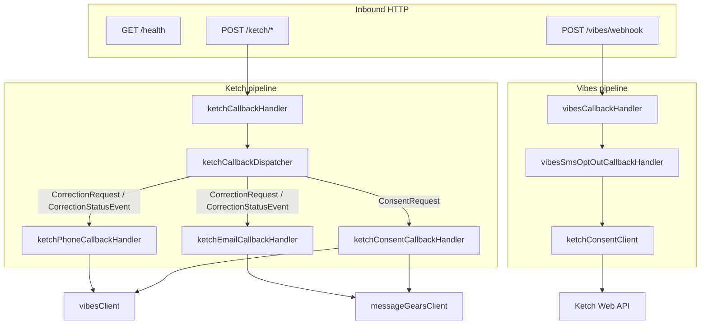

# Code architecture

This document describes how **s14s-consent-dispatch** is organized, how requests flow through the codebase, and which module owns each responsibility. For deployment, env vars, and sample payloads, see the [README](../README.md).

**Function reference and step-by-step sequence control** (every export, branching order, async order): [docs/API.md](API.md).

## Design goals

- **Stateless** — No database; each request is handled from JSON body + environment config.
- **Thin HTTP layer** — Routes validate auth and delegate to callback-handlers.
- **Protocol-specific handlers** — Ketch Forwarder, Vibes MO callbacks, and downstream APIs are isolated in named modules rather than one giant switch.
- **Loop-safe consent** — Origin markers in Ketch `context` prevent Vibes/MessageGears echo updates when the change started downstream.

## Request entry points

| HTTP | Middleware | Route handler | Delegates to |
|------|------------|---------------|--------------|
| `GET /health` | — | inline in `app.js` | `{ status: "ok" }` |
| `POST` (Ketch paths) | IP allowlist → shared-secret auth | `routes/ketchCallbackHandler.js` | `services/ketchCallbackDispatcher.js` |
| `POST /vibes/webhook` (default) | IP allowlist → shared-secret auth | `routes/vibesCallbackHandler.js` | `callback-handlers/vibesSmsOptOutCallbackHandler.js` |

Ketch paths come from `KETCH_CALLBACK_PATHS` (default `/ketch/webhook`, `/ketch/forwarder`). The Vibes path comes from `VIBES_CALLBACK_PATH`.



## Ketch dispatcher (`ketchCallbackDispatcher.js`)

All Ketch Forwarder POSTs share one dispatcher. Routing is by `body.kind`:

```
body.kind
├── ConsentRequest          → ketchConsentCallbackHandler (SMS/email opt-out)
├── CorrectionRequest       → phone handler, else email handler
├── CorrectionStatusEvent   → same as CorrectionRequest
└── (anything else)         → 200 { downstream: [] }
```

**Corrections** (identity sync):

1. `ketchPhoneCallbackHandler` — If a phone change is detected in identities/context/formData → `vibesClient.updatePersonPhone`.
2. Else `ketchEmailCallbackHandler` — If an email change is detected → `messageGearsClient.updateRecipientEmail`.
3. Phone wins when both appear in the same payload.

**Consent** (marketing opt-out):

1. `ketchConsentPayloadParser` — Detects denied purposes and resolves downstream IDs.
2. For SMS denied + `person_key` → `vibesClient.unsubscribePersonFromList` (unless Vibes origin context).
3. For email denied + `recipient_id` or external id → `messageGearsClient.optOutRecipient` (unless MessageGears origin context).
4. Both channels can run in one request; `downstream` may contain two entries.

## Vibes MO opt-out pipeline

```
POST /vibes/webhook
  → vibesInboundParser.parseSmsOptOutPayload(body)
       • message_type must be MO (or omitted → treated as MO)
       • message body must match VIBES_SMS_OPT_OUT_KEYWORDS (default "no")
       • requires person_key and/or E.164 phone
  → (if matched) ketchConsentClient.recordSmsMarketingOptOut(...)
       • POST {KETCH_API_BASE_URL}/consent/{org}/update
       • sets context.consent_dispatch_origin = vibes_sms_optout
  → 200 { downstream: [{ system: "Ketch", update: <status> }] }
```

If the payload is not an opt-out keyword, the handler returns `200` with `downstream: []` (acknowledge without side effects).

## Module reference

### Routes (`src/routes/`)

Thin adapters: parse Express `req.body`, call a handler, map `{ status, body }` to `res.status().json()`.

| File | Role |
|------|------|
| `ketchCallbackHandler.js` | Ketch Forwarder POST adapter |
| `vibesCallbackHandler.js` | Vibes inbound POST adapter |

### Callback handlers (`src/callback-handlers/`)

Business logic for one inbound protocol + action. Return `{ status: 200, body: { downstream: [...] } }` on success; throw `Error` with `error.status` for HTTP errors.

| File | Trigger | Downstream |
|------|---------|------------|
| `ketchPhoneCallbackHandler.js` | Ketch correction with phone change | Vibes Person API |
| `ketchEmailCallbackHandler.js` | Ketch correction with email change | MessageGears recipient API |
| `ketchConsentCallbackHandler.js` | Ketch `ConsentRequest` with denied SMS/email purposes | Vibes unsubscribe + MessageGears opt-out |
| `vibesSmsOptOutCallbackHandler.js` | Vibes MO keyword opt-out | Ketch consent update |

### Services (`src/services/`)

Shared parsing, clients, and utilities.

| File | Role |
|------|------|
| `ketchCallbackDispatcher.js` | Routes Ketch `kind` to the correct callback-handler |
| `ketchPayloadParser.js` | Phone/email extraction for **correction** payloads |
| `ketchConsentPayloadParser.js` | Purpose + identity extraction for **consent** payloads |
| `ketchCorrectionUtils.js` | `request` vs `event` envelope; kind sets (`CORRECTION_KINDS`, `CONSENT_KINDS`) |
| `ketchConsentClient.js` | Outbound Ketch Web API `setConsent` (Vibes → Ketch path) |
| `consentOrigin.js` | Read/write `consent_dispatch_origin` context for loop guards |
| `vibesInboundParser.js` | Vibes MO body → opt-out struct |
| `vibesClient.js` | Vibes Mobile DB: phone update, subscription DELETE |
| `messageGearsClient.js` | MessageGears: email update, opt-out PUT/POST |
| `callbackResponse.js` | Standard `{ downstream: [{ system, update, updated }] }` builder |
| `phoneNormalizer.js` / `emailNormalizer.js` | E.164 and email normalization |
| `clientIp.js` / `ipAllowlist.js` | Client IP for allowlists |

### Middleware (`src/middleware/`)

| File | Role |
|------|------|
| `ketchCallbackAuth.js` | Validates `KETCH_CALLBACK_AUTH_*` header; local-dev peer check |
| `ketchCallbackIpAllowlist.js` | `KETCH_ALLOWED_IPS` (empty or unset = deny all) |
| `vibesCallbackAuth.js` | Same pattern for `VIBES_CALLBACK_AUTH_*` |
| `vibesCallbackIpAllowlist.js` | `VIBES_ALLOWED_IPS` (empty or unset = deny all) |

### Configuration (`src/config.js`)

All settings are read from `process.env` on each access (no restart required for tests). Lists are comma-separated strings split into arrays. See [`.env.example`](../.env.example) for the full variable list.

## Identity resolution

Ketch payloads carry identities in `request.identities` or `event.identities`. Which `identitySpace` maps to which downstream field is **configurable** (see README Configuration).

| Downstream need | Default identity spaces (env override) |
|-----------------|----------------------------------------|
| Vibes `person_key` | `vibes_person_key`, `person_key` |
| Vibes `external_person_id` | `account_id`, `external_person_id`, `customer_id` |
| Phone (Ketch write / parsing) | `phone`, `mobile`, `mdn`, `mobile_phone` |
| MessageGears `recipient_id` | `messagegears_recipient_id`, `recipient_id` |
| MessageGears external id | `account_id`, `external_person_id`, … |

Corrections also scan `request.context` and `request.subject.formData` for phone/email keys (`KETCH_PHONE_CONTEXT_KEYS`, `KETCH_EMAIL_CONTEXT_KEYS`).

## Consent purposes

Marketing opt-out is detected when a configured purpose code in `request.purposes` equals `"denied"` (case-insensitive key match).

| Channel | Default purpose env | Handler |
|---------|---------------------|---------|
| SMS → Vibes | `KETCH_SMS_MARKETING_PURPOSE_CODES` (`sms_mktg`) | `ketchConsentCallbackHandler` |
| Email → MessageGears | `KETCH_EMAIL_MARKETING_PURPOSE_CODES` (`email_mktg`) | `ketchConsentCallbackHandler` |
| Vibes MO → Ketch | same SMS codes | `ketchConsentClient` |

## Loop guards (`consentOrigin.js`)

When recording consent in Ketch from Vibes, the service sets:

```json
"context": { "consent_dispatch_origin": "vibes_sms_optout" }
```

When Ketch later forwards a `ConsentRequest`, `ketchConsentPayloadParser` sets `skipVibes: true` if that value is present, so `ketchConsentCallbackHandler` does not call Vibes again.

The same pattern exists for MessageGears email (`messagegears_email_optout`) for future inbound email opt-out sources.

**Important:** Register `consent_dispatch_origin` as a Ketch data subject variable so it appears on Forwarder payloads.

## Response format

Successful handlers return HTTP **200** with:

```json
{
  "downstream": [
    {
      "system": "Vibes",
      "update": 204,
      "updated": "20260501T12:12:12.123"
    }
  ]
}
```

- `downstream` is empty when nothing was updated (unknown kind, no matching field, loop guard, or non-opt-out Vibes message).
- `update` is the HTTP status from the downstream API.
- `updated` is a UTC timestamp string generated in `callbackResponse.js`.

Errors use `error.status` (e.g. 400, 401, 403, 422, 502) and optional `error.body` from downstream APIs.

## Adding a new integration

1. **Outbound from Ketch** — Add a callback-handler (or extend `ketchConsentCallbackHandler`), a client in `services/`, and parser helpers if needed. Register the `kind` in `ketchCallbackDispatcher.js` or `ketchCorrectionUtils.js`.
2. **Inbound to Ketch** — Add a route in `app.js`, middleware for auth, a parser, and a `ketchConsentClient` (or extend it) method; define an origin marker in `consentOrigin.js` and skip logic in `ketchConsentPayloadParser.js`.
3. **Tests** — Jest expects **100%** coverage (`jest.config.js`); add unit tests under `tests/` mirroring existing patterns.
4. **Examples** — Add JSON under `examples/ketch/` or `examples/vibes/` and an entry in `scripts/smoke-local.js`.

## Examples and local testing

| Directory | Purpose |
|-----------|---------|
| `examples/ketch/` | Sample Forwarder bodies for `npm run smoke:local` |
| `examples/vibes/` | Sample Vibes MO opt-out callback |
| `docker/wiremock/mappings/` | Stubs for Vibes, MessageGears, and Ketch APIs on port 8080 |

Run the full stack: `npm run dev:compose`, then `npm run smoke:local`.
